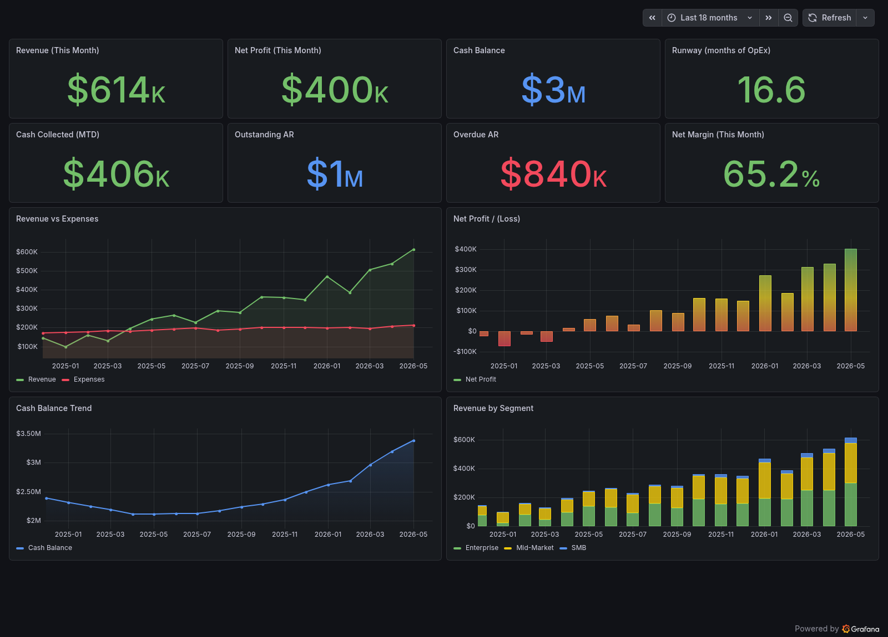
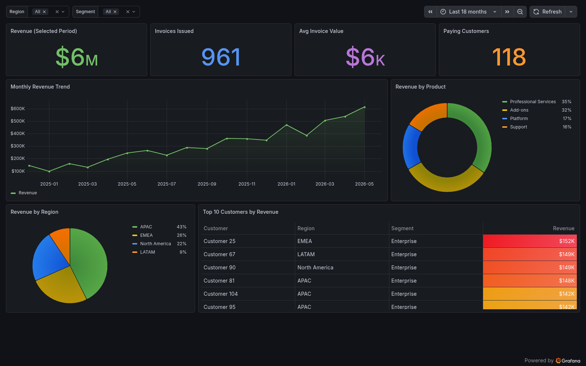
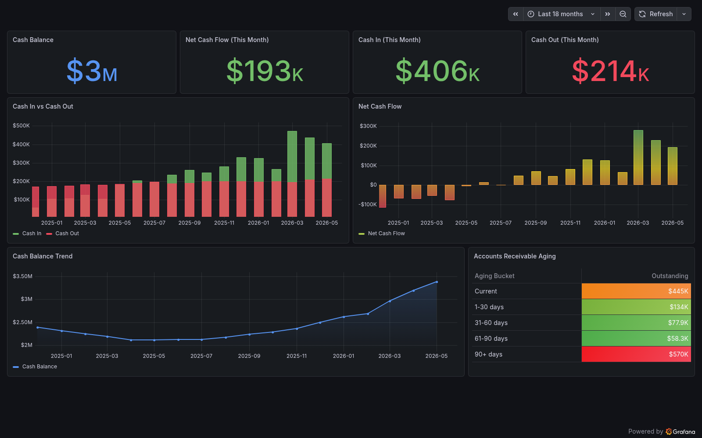
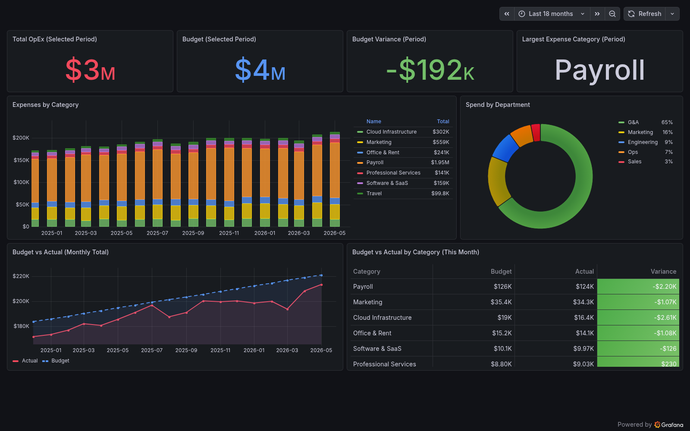

# Grafana Playbook: Business Finance Visualization

A practical, runnable playbook for visualizing business finance data in Grafana —
revenue, cash flow, expenses, budgets, and the executive KPIs that sit on top of them.

It ships with a one-command local stack (Grafana + PostgreSQL + Prometheus) seeded
with ~18 months of realistic finance data, four provisioned dashboards, and a written
playbook covering data modeling, metric definitions, dashboard design, and alerting.

Live showcase: https://qudiqudi.github.io/grafana-playbook-finance/



The screenshots below are rendered from the bundled stack against generated mock data.

## What's inside

```
.
├── docker-compose.yml          One-command stack: Grafana, Postgres, Prometheus
├── playbook/                   The written guide (start here)
│   ├── 01-overview.md
│   ├── 02-data-sources.md
│   ├── 03-metrics-and-kpis.md
│   ├── 04-dashboard-design.md
│   ├── 05-alerting.md
│   └── 06-operations.md
├── dashboards/                 Importable Grafana dashboard JSON
│   ├── executive-overview.json
│   ├── revenue-and-sales.json
│   ├── cash-flow.json
│   └── expenses-and-budget.json
├── provisioning/               Auto-loads data sources + dashboards on startup
├── sql/                        Postgres schema + seed data generator
└── prometheus/                 Prometheus config for operational finance metrics
```

## Quick start

Requires Docker and Docker Compose.

```bash
docker compose up -d
```

Then open Grafana at http://localhost:3000 (login `admin` / `admin`).

The stack provisions everything automatically:

- A PostgreSQL data source (`finance-postgres`) wired to a seeded finance database
- A Prometheus data source (`finance-prometheus`)
- All four dashboards under the **Finance** folder

Tear it down with `docker compose down` (add `-v` to also drop the seeded database).

## The dashboards

| Dashboard | Answers | Primary source |
|-----------|---------|----------------|
| Executive Overview | How is the business doing this month? | Postgres |
| Revenue & Sales | Where is revenue coming from and where is it going? | Postgres |
| Cash Flow | Are we cash-positive, and what's our runway? | Postgres |
| Expenses & Budget | Are we on budget, and where is money leaking? | Postgres |

Each dashboard's SQL is written against the schema in [`sql/schema.sql`](sql/schema.sql),
so you can read the queries as documentation of how every metric is calculated.

### Revenue & Sales



### Cash Flow



### Expenses & Budget



## Using it against your own data

This playbook is data-source agnostic. The dashboards target PostgreSQL by default
because that's where most business finance data lives (app DB or warehouse), but the
patterns transfer directly to MySQL, BigQuery, Snowflake, or Prometheus.

See [`playbook/02-data-sources.md`](playbook/02-data-sources.md) for how to repoint the
dashboards at your own warehouse, and [`playbook/03-metrics-and-kpis.md`](playbook/03-metrics-and-kpis.md)
for the metric definitions you'll need to reproduce.

## License

MIT — see [LICENSE](LICENSE).
